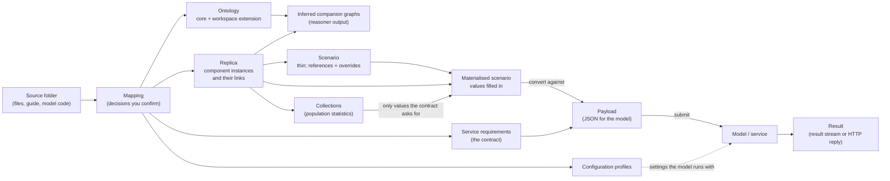

# Concepts and how data flows

Digicities is a requirements-driven semantic layer that connects models to the
data they need: each model states its inputs as requirements against a shared
ontology, and the platform finds, checks and delivers that data from a
knowledge graph.

This page names the pieces and shows how data moves between them. Each concept
says what it is, where it lives, and what creates it. File paths are relative
to the workspace folder (see [WORKSPACE_LAYOUT.md](WORKSPACE_LAYOUT.md)).
Graph names are the named graphs in the workspace's triplestore dataset (see
`backend/graphdb/graphs.py`).

## The flow in one picture

Read it left to right. You onboard a folder. The mapping decides which
classes, attributes and links your data has. The build writes the ontology
extension, the replica, the service contract and the configuration. A scenario
picks components from the replica and changes some values. Convert fills the
contract from the scenario and produces the payload. Submit sends it to the
model, and the model's answer comes back on the result stream (Redis) or as the
HTTP reply.

## The concepts

### Workspace

A workspace is one project: its ontology extension, its data, its scenarios
and its services. It is a folder with a fixed layout, plus one dataset in the
triplestore that holds the same content as named graphs.

- **Lives in:** the workspace folder (`ontology/`, `ingestion/`, `scenarios/`,
  `services/`, `workspace_meta/`, ...) and a triplestore dataset of the same id.
- **Created by:** the workspace switcher in the web app (`POST /api/workspaces`).

### Ontology: core and workspace extension

The ontology says what kinds of things exist and how they relate. The **core**
is shared by every workspace: component classes (`Component` and its tree),
attribute classes (`Attribute`, its value kinds and the `ComponentAttribute`
tree), and link predicates (everything under `linksComponent`). A **workspace
extension** adds the classes one project needs, for example `WindTurbine` under
the core `Turbine`. Every component class has an attribute category and a
`has<Class>Attribute` predicate whose range is that category; the ontology
manager writes this pattern for every class it adds.

- **Lives in:** core: `data/ontology/dici_onto_core.ttl` in the platform (built
  from the ontology repo). Extension: `ontology/extensions/*.ttl`. Both are
  loaded into the graph `http://ontology_dici_onto`.
- **Created by:** the onboarding agent (it replays an instruction file,
  `ontology/extensions/<workspace>_extension_instructions.json`, through the
  ontology manager), or by hand in the **Ontology Manager** module.

### Replica

The replica is your data as instances of the ontology's classes: one node per
real thing (each wind turbine, the wind park), its attribute values, and the
links between things (`Alkmaar_1 locatedIn WindparkAlkmaar`).

- **Lives in:** `ingestion/output/<workspace>.ttl` (the file is the source of
  truth) and the graph `http://classes_and_attributes`. The workbook it was
  converted from is `ingestion/input/<workspace>.xlsx`.
- **Created by:** the agent's build (the mapping's extraction plan reads every
  record from your files into the workbook, the converter turns the workbook
  into the replica), or the **Replica Builder** module.

#### Asserted and inferred

At every write the platform runs a reasoner over the ontology and the data.
What it derives (an inverse such as `WindparkAlkmaar locationOf ...`, a
super-property such as `linksComponent`, the super-classes of each instance)
goes into a separate **inferred companion graph**. The asserted graph keeps
exactly what you built.

- **Lives in:** `http://inferred/classes_and_attributes`,
  `http://inferred/ontology_dici_onto` and `http://inferred/services`. They are
  rebuilt after each write and are never edited by hand.
- **Why:** "which link did I choose?" reads only the asserted graph. Queries
  that need reasoning (for example "every `Component`", which must include
  `WindTurbine` instances) read both.

### Scenario and thin scenario

A scenario is the set of components a model run uses, with any values you
changed. A **thin scenario** does not copy the replica. It references the
replica's components and holds only the changes: each changed attribute is a
new node that `supersedesAttribute` the replica's attribute. A variant names the
scenario it starts from with `basedOn`. A **materialised (full) scenario** is
the thin one with every referenced value filled in from the replica.

- **Lives in:** thin: `scenarios/<name>.ttl` and the graph `http://scenarios`.
  Full: `scenarios/<name>_full.ttl`, written on request.
- **Created by:** the agent writes `scenarios/baseline.ttl` after a build and
  builds more from a plain-language description; the **Scenario Builder**
  module; the chat command `materialize scenario <name>` for the full copy.

### Assumption

An assumption is a reason for changing values in a scenario, for example "all
setpoints rise by 1 °C". Today it is applied, not stored: the Streamlit
Assumptions module turns it into a thin variant scenario (overrides plus
`basedOn` the baseline). The core has an `Assumption` class, but scenarios do
not yet link to an assumption node. See
[KNOWN_LIMITATIONS.md](KNOWN_LIMITATIONS.md).

- **Lives in:** the overrides of the thin scenario it produced.
- **Created by:** the Assumptions module in the Streamlit app.

### Service

A service is a model the platform can run: how to reach it (HTTP URL, or Redis
request and result streams), what data it needs, and the settings it runs with.

- **Lives in:** `services/<Name>.yaml` (contract and connection),
  `services/<Name>.ttl` (requirements and configuration, loaded into
  `http://services`), and `services/<Name>.interface.json` (an example payload
  for the model's developers).
- **Created by:** the agent's build; the **Service Requirements** module.

### Service requirements: the contract

The contract says, in ontology terms, exactly which data the model receives
and in what shape. Its `scenario_data` block is a template: `WindPark.Roughness`
reads an attribute of a component, `CL.WindPark.WindTurbine` nests the
turbines linked to each park, and a dotted path such as
`Weather.WindspeedForecast.hasLiveTimeSeriesReference` reads a property of an
attribute (here the live stream address). The contract states every component
link the model needs. A streamed input is a component in its own right
(`CL.WindPark.Weather`), and its live attribute carries the stream address.

- **Lives in:** `services/<Name>.yaml`; its requirements also as triples in
  `http://services`.
- **Created by:** the agent's build and service review (`drop`, `add`,
  `rename ... to ...`, `require`, `optional`, `done`); the **Service
  Requirements** module. The syntax is specified in
  [SERVICE_REQUIREMENTS_SPEC.md](SERVICE_REQUIREMENTS_SPEC.md).

### Configuration profile

A configuration profile holds the settings a model runs with, as opposed to
data about components. One profile is made per configuration file the model
reads, and each setting is one parameter. Settings that are empty or are
placeholders (`${ENV}`) are listed as "set at deployment" and never stored.

- **Lives in:** `services/<Name>.ttl` as a `ServiceConfiguration` with
  `ConfigurationAttribute` parameters, loaded into `http://services`.
- **Created by:** the agent's build, from the folder's configuration files.

### Collection

A collection is a set of attribute values and its statistics: for example the
hub heights of the turbines in each park, with mean, standard deviation and
count. The platform builds one for every population of linked records, so the
**Collections** view always shows the distributions. When a contract asks for
a statistic (`Tree.WeightMean`), that value is attached to each container and
delivered with the scenario. A scenario never carries the collection's own
bookkeeping.

- **Lives in:** the graph `http://collections`. It is derived and recomputed on
  every data reload.
- **Created by:** provisioning (population collections) and Convert (the
  statistics a contract asks for); the **Collections** module.

### Payload

The payload is the JSON the model receives: the contract's template filled
from a materialised scenario.

- **Lives in:** `scenarios/<name>.payload.json`. The agent's check that the
  payload holds everything the contract and the source data say it should is
  `workspace_meta/payload_check.json`.
- **Created by:** the chat command `convert`, or the **API Submission** module.
  `submit` sends it over the service's transport.

### Result

What the model sends back: a message on the service's Redis result stream
(matched to the request by its `request_id`), or the HTTP response.

- **Lives in:** the model's result stream or the HTTP reply. The platform does
  not store results in the graph today.
- **Created by:** the model.

## Where to go next

- [GETTING_STARTED.md](GETTING_STARTED.md) to run the platform.
- [ONBOARDING_A_USECASE.md](ONBOARDING_A_USECASE.md) to onboard your own folder.
- [INTEGRATING_A_SERVICE.md](INTEGRATING_A_SERVICE.md) to connect a model.
- [ARCHITECTURE.md](ARCHITECTURE.md) for how the code is organised.
- [KNOWN_LIMITATIONS.md](KNOWN_LIMITATIONS.md) for what does not work yet.
